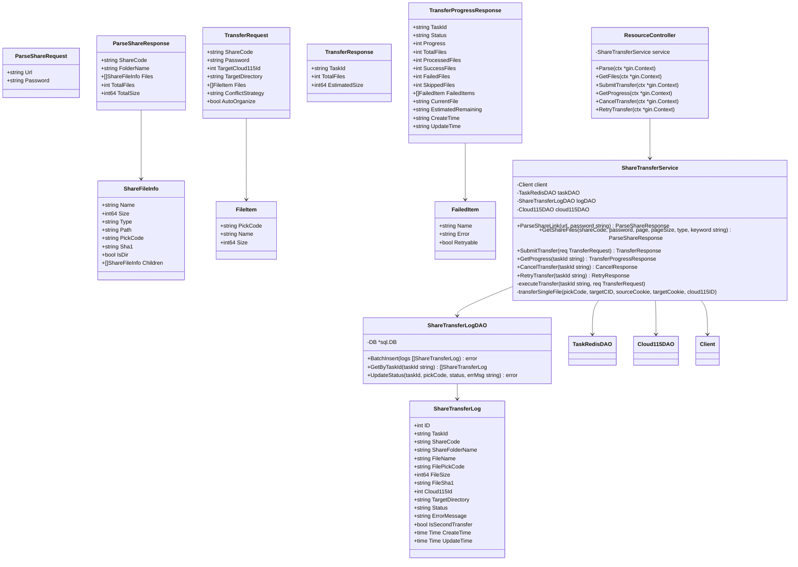
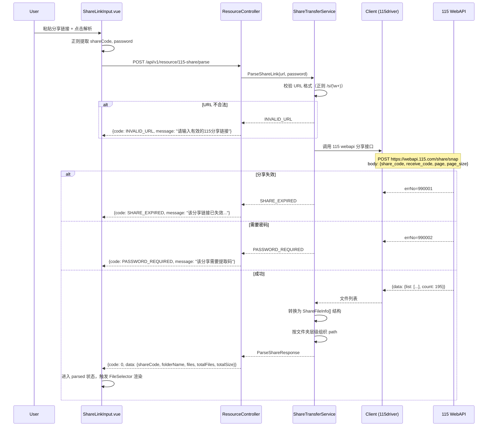
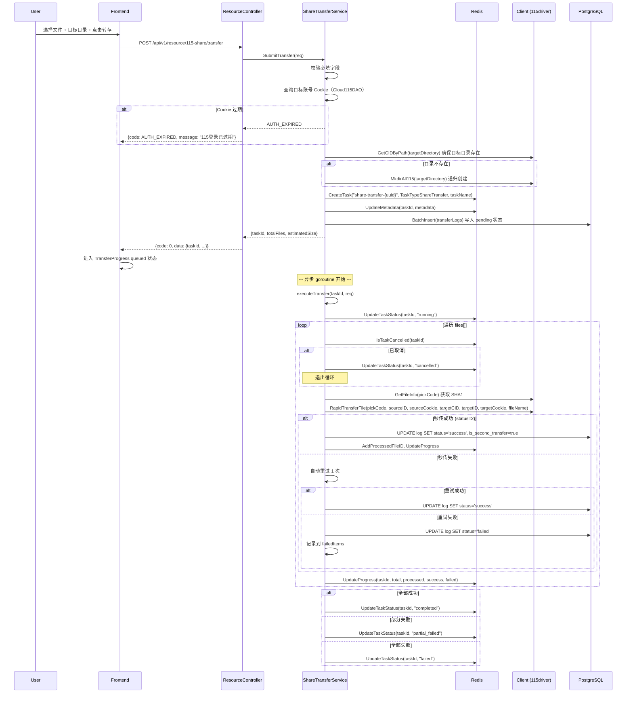
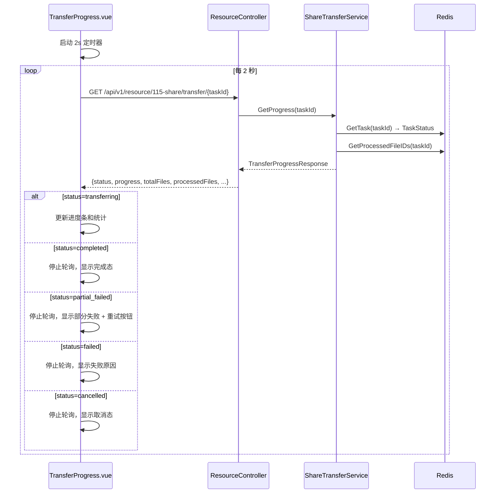
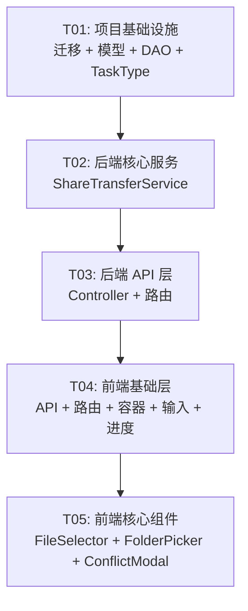

# 115 分享链接一键转存 — 系统设计

- **设计者**：Bob (Architect)
- **输入文档**：[PRD](./prd-resource-aggregation-2026-07-24.md) · [执行规格](../deliverables/product-strategy/exec-spec-115-share-2026-07-24.md)
- **日期**：2026-07-24
- **版本**：v1.0

---

## Part A: 系统设计

### 1. 实现方案

#### 1.1 核心技术挑战

| 挑战 | 分析 | 策略 |
|------|------|------|
| **115 分享解析 API** | 115 无公开分享解析 API，需逆向 web 端接口 | 使用 `github.com/SheltonZhu/115driver` 的 HTTP 能力 + 自定义 webapi 请求 |
| **秒传（Second Transfer）** | 分享转存本质是「跨账号秒传」，依赖 SHA1 | 复用现有 `RapidTransferFile()` 和 `RapidTransferByMethod()`，封装为分享→自己账号转存 |
| **大目录性能** | 1000+ 文件分享需分页+虚拟滚动 | 后端分页 200/页 + Redis 缓存解析结果；前端 vue-virtual-scroller |
| **任务断点续传** | 服务重启后转存进度不丢失 | 复用现有 `AddProcessedFileID` / `IsFileProcessed` Redis Set 机制 |
| **限频控制** | 115 对批量操作有频率限制 | 复用现有 `TransferLimiter`，串行化转存，200ms 间隔 |

#### 1.2 框架与库选型

| 层 | 选型 | 理由 |
|----|------|------|
| **后端框架** | Gin（现有） | 已在项目中使用，无需新增 |
| **115 API 客户端** | `github.com/SheltonZhu/115driver`（现有） | 已封装 driver 缓存、秒传签名、文件操作 |
| **任务框架** | Redis（现有 task.go/task_dao.go） | 复用 TaskStatus + metadata 扩展，无需引入消息队列 |
| **数据库** | PostgreSQL（现有） | 新增 `t_share_transfer_log` 表持久化转存日志 |
| **前端框架** | Vue 3 + Naive UI（现有） | 保持与现有项目一致，**不使用 MUI** |
| **虚拟滚动** | vue-virtual-scroller 或 Naive UI 内置虚拟列表 | 处理 1000+ 文件渲染 |

#### 1.3 架构模式

```
┌─────────────────────────────────────────────────────────────────┐
│                        Frontend (Vue 3)                         │
│  ResourceAggregation.vue → ResourceTransfer.vue                 │
│    ├── ShareLinkInput.vue    (4 states)                         │
│    ├── FileSelector.vue      (5 states, virtual scroll)         │
│    ├── TargetFolderPicker.vue (3 states)                        │
│    ├── ConflictPreviewModal.vue                                 │
│    └── TransferProgress.vue  (6 states, polling 2s)             │
├─────────────────────────────────────────────────────────────────┤
│                    Backend (Go + Gin)                            │
│  Controller: resource_controller.go                             │
│    POST /api/v1/resource/115-share/parse                        │
│    GET  /api/v1/resource/115-share/files                        │
│    POST /api/v1/resource/115-share/transfer                     │
│    GET  /api/v1/resource/115-share/transfer/{taskId}            │
│    POST /api/v1/resource/115-share/transfer/{taskId}/cancel     │
│    POST /api/v1/resource/115-share/transfer/{taskId}/retry      │
│  Service: share_transfer_service.go                             │
│    ├── ParseShareLink()   → 115 webapi 调用                     │
│    ├── SubmitTransfer()   → 创建 Redis 任务 + goroutine          │
│    ├── ExecuteTransfer()  → 逐个 RapidTransferFile              │
│    ├── GetProgress()      → 读取 Redis TaskStatus               │
│    ├── CancelTransfer()   → SetTaskCancelFlag                   │
│    └── RetryTransfer()    → 重新提交 failed items               │
│  DAO: share_transfer_log_dao.go → PostgreSQL CRUD               │
├─────────────────────────────────────────────────────────────────┤
│                    Infrastructure                                │
│  Redis: task state + progress set + cancel flag + parse cache   │
│  PostgreSQL: t_share_transfer_log (持久化日志)                   │
│  115driver: RapidTransferFile, GetFileInfo, MkdirAll115         │
└─────────────────────────────────────────────────────────────────┘
```

---

### 2. 文件列表

#### 2.1 新增文件

```
# 后端
easy-strm/internal/domain/models.go                    # [修改] 新增 ShareFileInfo, TransferRequest 等
easy-strm/internal/service/share_transfer_service.go    # [新增] 核心业务逻辑
easy-strm/internal/controller/resource_controller.go   # [新增] HTTP 处理器
easy-strm/internal/dao/share_transfer_log_dao.go       # [新增] 转存日志 DAO
easy-strm/migrations/migrate_v14_share_transfer_log.sql # [新增] 数据库迁移

# 前端
easy-strm-front/src/utils/api/resource.js               # [新增] API 封装
easy-strm-front/src/views/ResourceAggregation.vue       # [新增] Tab 容器
easy-strm-front/src/views/resources/ResourceTransfer.vue # [新增] 转存主页面
easy-strm-front/src/components/resource/ShareLinkInput.vue      # [新增] 链接输入
easy-strm-front/src/components/resource/FileSelector.vue        # [新增] 文件选择
easy-strm-front/src/components/resource/TargetFolderPicker.vue  # [新增] 目录选择
easy-strm-front/src/components/resource/ConflictPreviewModal.vue # [新增] 冲突预览
easy-strm-front/src/components/resource/TransferProgress.vue     # [新增] 进度跟踪
```

#### 2.2 修改文件

```
# 后端
easy-strm/task.go                                      # [修改] 新增 TaskTypeShareTransfer, TaskTypeShareParse
easy-strm/auth.go                                      # [修改] 注册 6 个新路由
easy-strm/internal/dao/task_dao.go                     # [修改] 新增 UpdateMetadata 已存在（复用）

# 前端
easy-strm-front/src/main.js                            # [修改] 新增路由 /dashboard/resources/transfer
easy-strm-front/src/utils/api/index.js                 # [修改] 导出 resource 模块
```

---

### 3. 数据结构和接口

#### 3.1 后端领域模型



#### 3.2 现有 TaskStatus 扩展

在 `task.go` 中新增：

```go
const (
    TaskTypeShareTransfer TaskType = "share_transfer" // 115 分享转存
    TaskTypeShareParse    TaskType = "share_parse"    // 115 分享解析
)

var TaskTypeNames = map[TaskType]string{
    // ... existing ...
    TaskTypeShareTransfer: "分享转存",
    TaskTypeShareParse:    "分享解析",
}
```

TaskStatus metadata（通过 Redis `UpdateMetadata` 存储）：

```json
{
    "task_category": "resource_aggregation",
    "task_subtype": "share_transfer",
    "share_code": "swexample123",
    "share_folder_name": "4K Movie 2024",
    "target_cloud115_id": 1,
    "target_directory": "/媒体库/待整理",
    "conflict_strategy": "skip",
    "auto_organize": true,
    "skipped_files": 0,
    "failed_items": [...],
    "current_file": "Inception.mkv"
}
```

---

### 4. 程序调用流程

#### 4.1 分享链接解析流程（同步）



#### 4.2 转存提交与异步执行流程



#### 4.3 前端轮询进度流程



---

### 5. 现有代码复用分析

#### 5.1 可直接复用的模块

| 模块 | 文件 | 复用方式 |
|------|------|----------|
| **任务框架** | `task.go` | 新增 `TaskTypeShareTransfer` 常量，复用 CreateTask/SaveTask/GetTask/UpdateTaskStatus/UpdateTaskProgress/SetTaskError 全部函数 |
| **取消机制** | `task.go` | 复用 SetTaskCancelFlag/IsTaskCancelled/CancelTask，转存 goroutine 每迭代检查 |
| **进度追踪** | `task.go` | 复用 AddProcessedFileID/IsFileProcessed/GetProcessedFileIDs（Redis Set），记录已转存 pickCode |
| **任务恢复** | `task.go` | 复用 ResumeTask，retry 操作重置状态为 pending |
| **Driver 缓存** | `115client.go` | 复用 `getOrCreateDriver(cloud115ID, cookie)`，按账号缓存 driver 实例 |
| **秒传核心** | `115_rapid_transfer.go` | 复用 `RapidTransferFile()` 执行跨账号秒传（分享账号→目标账号） |
| **文件信息** | `115_file_ops.go` | 复用 `GetFileInfo()` 获取 SHA1，`GetPickCodeByPath()`，`GetCIDByPath()` |
| **目录创建** | `115_file_ops.go` | 复用 `MkdirAll115()` 递归创建目标目录 |
| **HTTP 代理** | `115client.go` | 复用 `NewProxyAwareHTTPClient()` 发起 115 webapi 请求 |
| **日志系统** | `log.go` | 复用 Info/Error/Debug/Warn 函数，格式 `[INFO] ShareTransfer | shareCode=xxx | action=parse` |
| **响应格式** | `auth_controller.go` | 复用 `SuccessResp(ctx, data)` / `ErrorResp(ctx, status, msg)` |
| **Cloud115DAO** | `internal/dao/cloud115_dao.go` | 复用 `GetByID()` 获取账号 Cookie |
| **速率限制** | `internal/service/transfer_limiter.go` | 复用 `TransferLimiter.Wait()` 控制转存频率 |

#### 5.2 需扩展的模块

| 模块 | 文件 | 扩展内容 |
|------|------|----------|
| **TaskType** | `task.go` | 新增 `TaskTypeShareTransfer`、`TaskTypeShareParse` 常量及中文名 |
| **路由注册** | `auth.go` | 在 `SetupAuthProtectedRoutes()` 中注册 6 个新路由 |

#### 5.3 全新的模块（无现有代码可复用）

| 模块 | 原因 |
|------|------|
| **分享链接解析** | 115 分享解析 API（webapi.115.com/share/snap）项目从未调用过 |
| **转存日志持久化** | 新需求：需 PostgreSQL 表记录每个文件的转存结果 |
| **前端 5 个组件** | 全新 UI 交互模式 |

---

### 6. 风险点

| 风险 | 说明 | 缓解 |
|------|------|------|
| **115 webapi 分享接口不稳定** | 非公开 API，可能变更 | 抽象解析层，POC 阶段先验证；关注返回 errNo |
| **分享→自己账号的秒传路径** | 分享转存与现有跨账号秒传有差异（分享账号 Cookie 是临时会话） | 分享解析时获取 receive_code，用 receive_code 代替 Cookie 做源端 |
| **Driver 缓存 key 冲突** | 分享 Cookie 的 driver 和账号 driver 共享缓存 | 分享操作用独立临时 driver，不写入缓存 |
| **大分享（>1000 文件）** | 解析和分页可能触发 115 限频 | Redis 缓存解析结果（5min TTL），分页从缓存读取 |
| **前端 Naive UI 虚拟滚动** | Naive UI 内置虚拟列表能力有限 | 如需要，引入 vue-virtual-scroller（轻量，~10KB） |

---

## Part B: 任务分解

### 6. Required Packages

```
# 后端（无新增第三方包，全部复用现有依赖）
- github.com/gin-gonic/gin（现有）
- github.com/SheltonZhu/115driver（现有）
- github.com/go-redis/redis/v8（现有）
- github.com/google/uuid（现有）

# 前端
- vue@^3.x（现有）
- naive-ui（现有，Naive UI，非 MUI）
- vue-virtual-scroller@^2.x（新增，处理 1000+ 文件虚拟滚动）
```

### 7. Task List

| Task ID | Task Name | Source Files | Dependencies | Priority |
|---------|-----------|-------------|--------------|----------|
| T01 | 项目基础设施 + 数据库 + 领域模型 | `migrations/migrate_v14_share_transfer_log.sql`, `task.go`（修改）, `internal/domain/models.go`（修改）, `internal/dao/share_transfer_log_dao.go`（新增） | 无 | P0 |
| T02 | 后端核心服务（解析 + 转存引擎） | `internal/service/share_transfer_service.go`（新增） | T01 | P0 |
| T03 | 后端 API 层（Controller + 路由注册） | `internal/controller/resource_controller.go`（新增）, `auth.go`（修改） | T02 | P0 |
| T04 | 前端基础层（API + 路由 + 容器 + 输入 + 进度） | `src/utils/api/resource.js`（新增）, `src/utils/api/index.js`（修改）, `src/main.js`（修改）, `src/views/ResourceAggregation.vue`（新增）, `src/views/resources/ResourceTransfer.vue`（新增）, `src/components/resource/ShareLinkInput.vue`（新增）, `src/components/resource/TransferProgress.vue`（新增） | T03 | P0 |
| T05 | 前端核心组件（文件选择 + 目录 + 冲突 + 集成） | `src/components/resource/FileSelector.vue`（新增）, `src/components/resource/TargetFolderPicker.vue`（新增）, `src/components/resource/ConflictPreviewModal.vue`（新增） | T04 | P0 |

### 8. Shared Knowledge

```
# 响应格式
- 所有 API 使用统一响应格式：SuccessResp → {state: true, code: 0, message: "success", data: ...}
- 错误使用：ErrorResp → {error: "用户可读的中文错误消息"}，HTTP 状态码用于区分错误类别

# 认证
- 所有 `/api/v1/resource/115-share/*` 路由在 JWT 中间件保护下
- 前端 axios 拦截器自动附加 Bearer token

# 任务 ID 格式
- 解析任务：share-parse-{uuid}
- 转存任务：share-transfer-{uuid}

# 日志格式
- 统一前缀：[INFO] ShareTransfer | shareCode=xxx*** | action=xxx | duration=X.Xs
- URL 脱敏：shareCode 仅记录前 4 位 + "***"
- 密码不落盘：password 不写入任何日志

# 115 Driver 使用
- 账号操作：使用 getOrCreateDriver(cloud115ID, cookie) 获取缓存 driver
- 分享操作：创建临时 driver 实例（不缓存），使用分享 Cookie/receive_code

# 前端组件约定
- 所有组件使用 Naive UI（n-input, n-button, n-checkbox, n-progress, n-tree, n-modal 等）
- 组件 props 驱动状态切换，不内部管理业务状态
- API 调用通过 src/utils/api/resource.js 统一封装

# 分页约定
- 默认 pageSize=200，最大 500
- 文件列表按 path 分组展示（文件夹折叠）
```

### 9. Task Dependency Graph



---

### 10. 待明确事项

| # | 事项 | 影响 | 建议 |
|---|------|------|------|
| Q1 | 115 webapi `/share/snap` 接口是否稳定可用？ | 解析功能核心依赖 | POC 阶段优先验证，15 分钟内可完成 |
| Q2 | 分享 Cookie 与账号 Cookie 是否相同？ | 秒传时源端鉴权 | POC 验证分享临时 Cookie 是否可调用 GetFileInfo |
| Q3 | 分享转存是否需要 `receive_code` 而非 pickCode？ | 转存 API 参数 | 查阅 115driver 是否有 share/receive 相关 API |
| Q4 | Naive UI Tree 组件能否满足 TargetFolderPicker 的懒加载目录树？ | 组件选型 | 如不支持，改用自定义递归组件 |
| Q5 | 转存完成后的 autoOrganize 触发方式？ | 与 Watch 服务的联动 | 通过 API 回调直接触发 organize，不走文件系统检测 |

---

## 附录：完整任务详情

### T01: 项目基础设施 + 数据库 + 领域模型

**涉及文件**：
- `easy-strm/migrations/migrate_v14_share_transfer_log.sql`（新增）— DDL 建表
- `easy-strm/task.go`（修改）— 新增 `TaskTypeShareTransfer`、`TaskTypeShareParse` 常量
- `easy-strm/internal/domain/models.go`（修改）— 新增 ShareFileInfo、TransferRequest 等结构体
- `easy-strm/internal/dao/share_transfer_log_dao.go`（新增）— BatchInsert、GetByTaskId、UpdateStatus

**功能范围**：
1. 执行规格第 3.2.4 节的 DDL，含 5 个索引
2. 遵循现有迁移命名规范 `migrate_v{N}_{description}.sql`
3. DAO 层遵循现有 `internal/dao/` 模式（使用 `database/sql` 原生操作）
4. 领域模型定义在 `internal/domain/models.go` 末尾追加

---

### T02: 后端核心服务（解析 + 转存引擎）

**涉及文件**：
- `easy-strm/internal/service/share_transfer_service.go`（新增）— 全部业务逻辑

**功能范围**：
1. `ParseShareLink(url, password)` — 调用 115 webapi 解析分享，返回文件列表
2. `GetShareFiles(...)` — 从 Redis 缓存读取并分页
3. `SubmitTransfer(req)` — 校验、创建 Redis 任务、启动 goroutine
4. `executeTransfer(taskId, req)` — 遍历文件调用 `RapidTransferFile`，更新进度
5. `GetProgress(taskId)` — 读取 Redis TaskStatus + 组装响应
6. `CancelTransfer(taskId)` — 设置取消标记
7. `RetryTransfer(taskId)` — 读取 failedItems，重新提交转存
8. 解析结果缓存到 Redis（`easy_strm:share:cache:{shareCode}`，TTL 5min）

**依赖**：`Client`（115driver）、`TaskRedisDAO`、`ShareTransferLogDAO`、`Cloud115DAO`

---

### T03: 后端 API 层（Controller + 路由注册）

**涉及文件**：
- `easy-strm/internal/controller/resource_controller.go`（新增）
- `easy-strm/auth.go`（修改）— 注册 6 个新路由

**功能范围**：
1. 6 个 HTTP handler，遵循现有 Controller 模式（struct + 回调注入）
2. 路由注册在 `SetupAuthProtectedRoutes()` 的 `auth` 路由组下
3. 请求校验（URL 格式、必填字段）
4. 错误码映射（15 种错误场景 → 用户可读中文）

**路由注册代码模式**（在 `auth.go` 中添加）：
```go
// ========== 115 分享转存 ==========
shareTransferService := service.NewShareTransferService(client, taskDAO, logDAO, cloud115DAO)
resourceController := controller.NewResourceController(shareTransferService)

auth.POST("/api/v1/resource/115-share/parse", resourceController.Parse)
auth.GET("/api/v1/resource/115-share/files", resourceController.GetFiles)
auth.POST("/api/v1/resource/115-share/transfer", resourceController.SubmitTransfer)
auth.GET("/api/v1/resource/115-share/transfer/:taskId", resourceController.GetProgress)
auth.POST("/api/v1/resource/115-share/transfer/:taskId/cancel", resourceController.CancelTransfer)
auth.POST("/api/v1/resource/115-share/transfer/:taskId/retry", resourceController.RetryTransfer)
```

---

### T04: 前端基础层（API + 路由 + 容器 + 输入 + 进度）

**涉及文件**：
- `src/utils/api/resource.js`（新增）
- `src/utils/api/index.js`（修改）
- `src/main.js`（修改）
- `src/views/ResourceAggregation.vue`（新增）
- `src/views/resources/ResourceTransfer.vue`（新增）
- `src/components/resource/ShareLinkInput.vue`（新增）
- `src/components/resource/TransferProgress.vue`（新增）

**功能范围**：
1. API 模块封装 6 个接口调用（复用 `api` axios 实例）
2. 路由：`/dashboard/resources/transfer` → ResourceTransfer（lazy import）
3. ResourceAggregation.vue：Tab 容器，当前只有「115 分享转存」一个 Tab，预留扩展
4. ResourceTransfer.vue：页面级状态管理，协调 4 个子组件
5. ShareLinkInput.vue：4 态（default/parsing/parsed/error），正则提取 URL
6. TransferProgress.vue：6 态（queued/transferring/completed/partial_failed/failed/cancelled），2s 轮询

**ShareLinkInput 状态流**：
```
default → (点击解析) → parsing → (成功) → parsed
                                → (失败) → error → (重试) → parsing
parsed → (重新解析) → default
```

**TransferProgress 轮询逻辑**（在 ResourceTransfer.vue 中管理）：
- 提交成功后启动 `setInterval(2000ms)` 轮询
- `completed/partial_failed/failed/cancelled` 时清除 interval
- 组件销毁时清除 interval

---

### T05: 前端核心组件（文件选择 + 目录 + 冲突 + 集成）

**涉及文件**：
- `src/components/resource/FileSelector.vue`（新增）
- `src/components/resource/TargetFolderPicker.vue`（新增）
- `src/components/resource/ConflictPreviewModal.vue`（新增）

**功能范围**：
1. FileSelector.vue：5 态（loading/loaded/filtered/empty/selected_summary）
   - 文件夹折叠展开（按 path 分组）
   - 类型筛选下拉（video/audio/image/document/folder/other）
   - 搜索（300ms 防抖，本地过滤）
   - 全选/反选
   - 底部统计栏（sticky）
   - >50 文件启用虚拟滚动
2. TargetFolderPicker.vue：3 态（collapsed/expanded/selecting）
   - 复用 `/115/files` API 获取目录树
   - 空间不足红色警告
   - 默认选中 Cloud115.TransferDirectory
3. ConflictPreviewModal.vue：
   - 转存前调用后端冲突检测
   - 3 种冲突策略选择（skip/overwrite/rename）
   - 显示冲突文件列表（文件名 + 大小对比）

**组件集成**（在 ResourceTransfer.vue 中）：
```
ShareLinkInput (parsed) → 触发 FileSelector + TargetFolderPicker 渲染
FileSelector + TargetFolderPicker → 用户点击「转存」→ 检查冲突
  → 有冲突 → ConflictPreviewModal
  → 无冲突 → 直接提交 → TransferProgress
```
